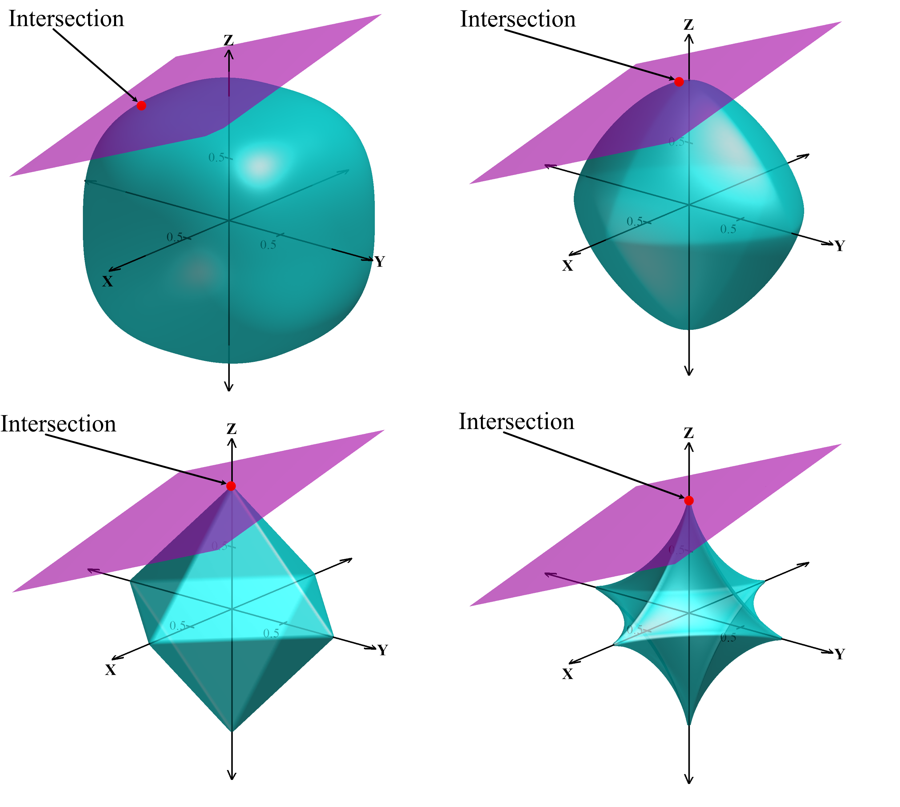
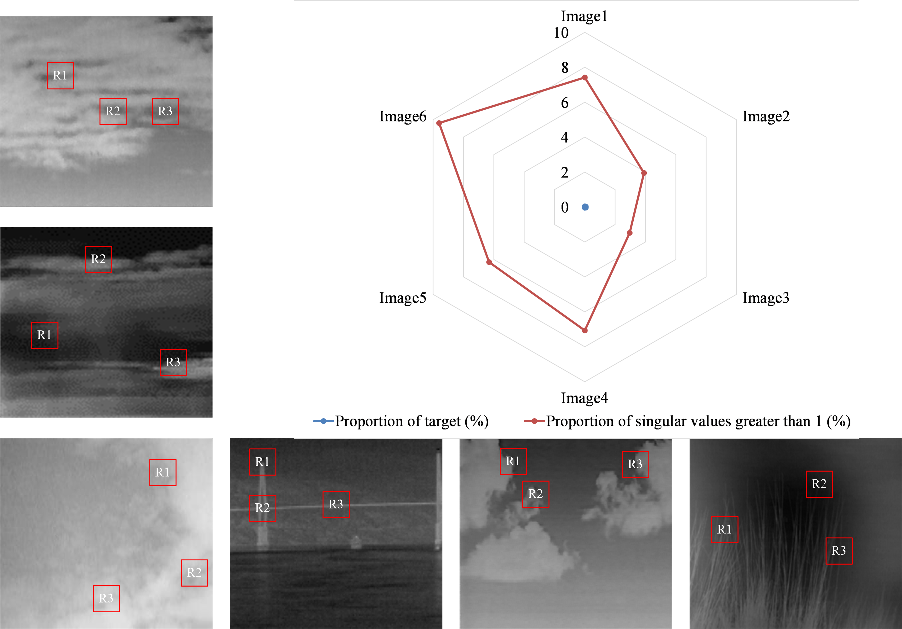
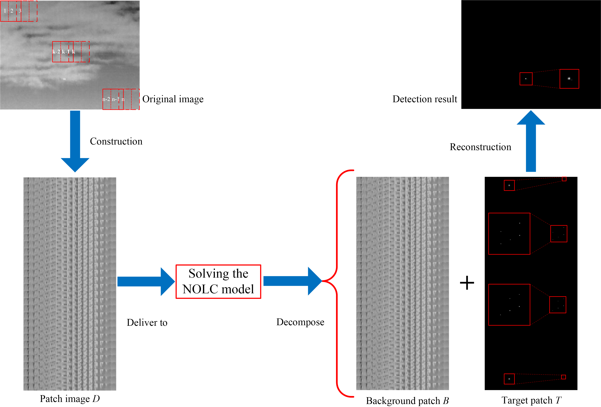
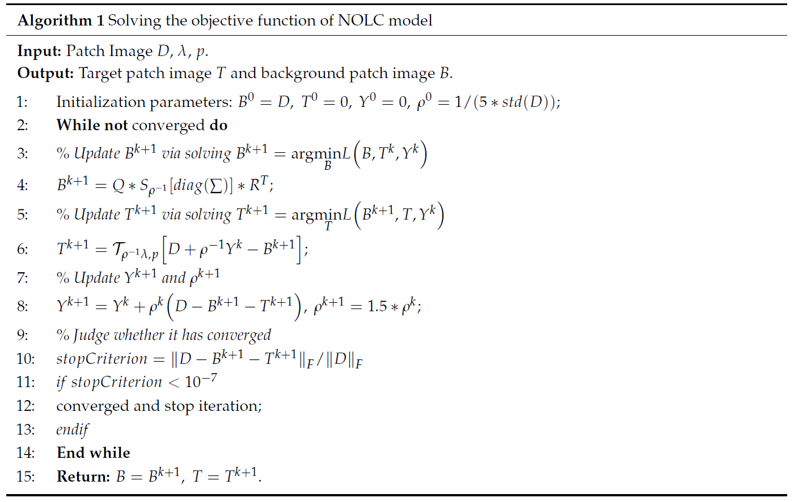
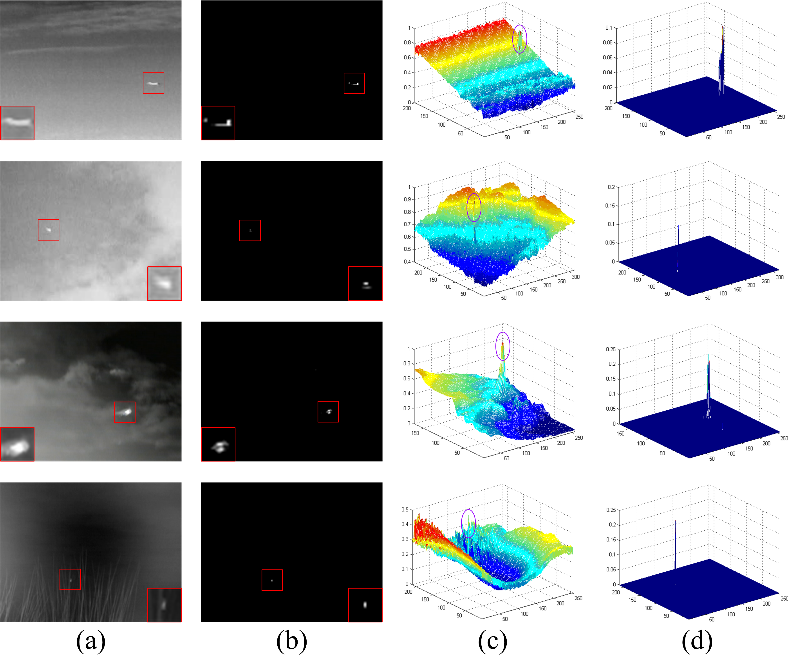
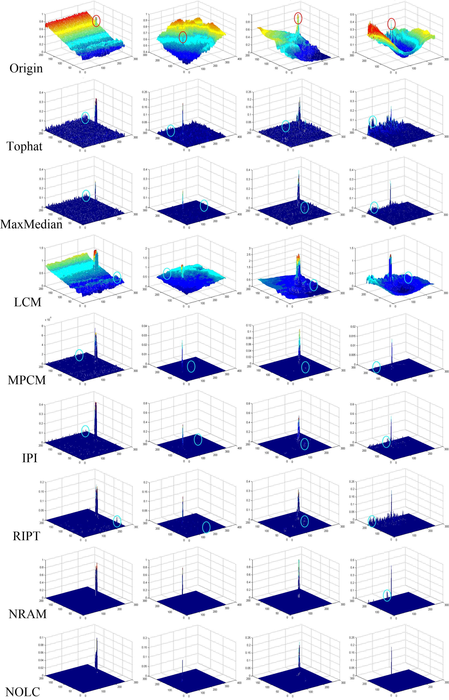
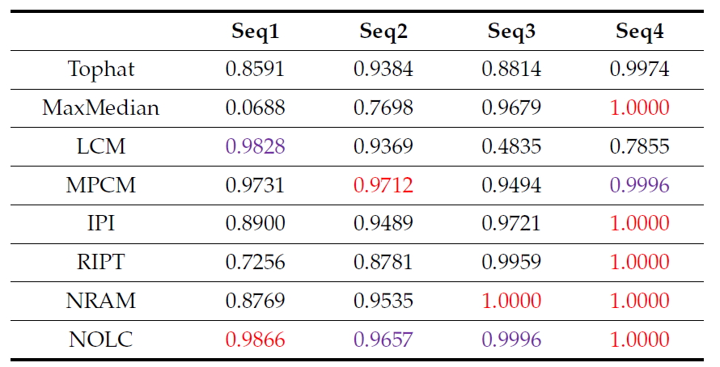
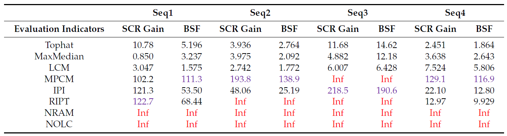
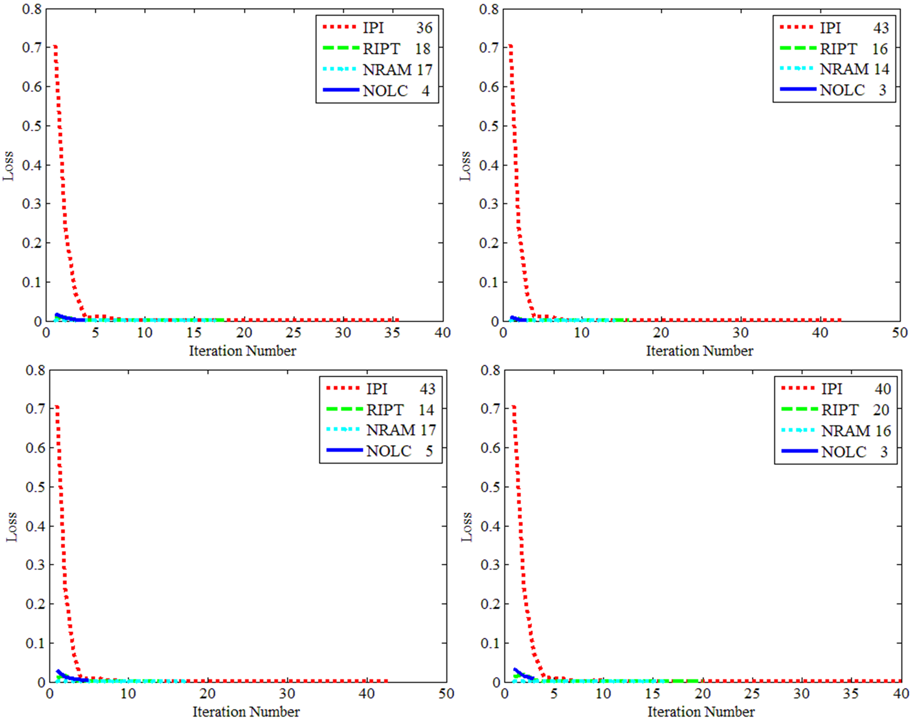

# Code-NOLC

[](https://github.com/ProfCarleton/NOLC)

[](./LICENSE)

This repository is for Non-convex Optimization with Lp-norm Constraint (NOLC) introduced in the following paper and is built in Matlab R2014a.

> Zhang T, Wu H, Liu Y, et al. [Infrared small target detection based on non-convex optimization with Lp-norm constraint](https://www.mdpi.com/2072-4292/11/5/559)[J]. Remote Sensing, 2019, 11(5): 559.

For more information about me, you can visit my [persional website](https://tianfang-zhang.github.io/).

## Contents
1. [Introduction](#introduction)
2. [Method](#Method)
3. [Test](#test)
4. [Results](#results)
5. [Citation](#citation)

## Introduction
The infrared search and track (IRST) system has been widely used, and the field of infrared small target detection has also received much attention. Based on this background, this paper proposes a novel infrared small target detection method based on non-convex optimization with Lp-norm constraint (NOLC). The NOLC method strengthens the sparse item constraint with Lp-norm while appropriately scaling the constraints on low-rank item, so the NP-hard problem is transformed into a non-convex optimization problem. First, the infrared image is converted into a patch image and is secondly solved by the alternating direction method of multipliers (ADMM). In this paper, an efficient solver is given by improving the convergence strategy. The experiment shows that NOLC can accurately detect the target and greatly suppress the background, and the advantages of the NOLC method in detection efficiency and computational efficiency are verified.

<center>
    
    <br>
    <div style="color:orange; border-bottom: 1px solid #d9d9d9;
    display: inline-block;
    color: #999;
    padding: 2px;">Figure 1. Geometry with different p values. From left top to right bottom,  equals to 2.8, 1.4, 1, 0.7, respectively.</div>
</center>

<center>
    
    <br>
    <div style="color:orange; border-bottom: 1px solid #d9d9d9;
    display: inline-block;
    color: #999;
    padding: 2px;">Figure 2. Illustration of low rank property and sparsity of infrared images.</div>
</center>

## Method

<center>
    
    <br>
    <div style="color:orange; border-bottom: 1px solid #d9d9d9;
    display: inline-block;
    color: #999;
    padding: 2px;">Figure 3. Detection flow of NOLC model.</div>
</center>

The iterative process of the NOLC model is given in the following table.
<center>
    
</center>


## Test
### Quick start
1. Download the code and test images in `./TestCode/`.

2. Modify the image path and $p$ value in the `demo.m`, and run the file.


## Results

### Qualitative Evaluation

#### Validity of Diverse Scene

<center>
    
    <br>
    <div style="color:orange; border-bottom: 1px solid #d9d9d9;
    display: inline-block;
    color: #999;
    padding: 2px;">Figure 4. Display of the NOLC results of Seq1 to Seq4. (a) The original image; (b) the result of NOLC; (c) 3D display of (a); (d) 3D display of (b).</div>
</center>  
  
In order to better display the target information, the target region in this Figure is enlarged and placed in the corner of the image.

####  Comparison to State-of-the-Art

<center>
    
    <br>
    <div style="color:orange; border-bottom: 1px solid #d9d9d9;
    display: inline-block;
    color: #999;
    padding: 2px;">Figure 5. 3D display of original image and multiple method processing results.</div>
</center>

<center>
    
    <br>
    <div style="color:orange; border-bottom: 1px solid #d9d9d9;
    display: inline-block;
    color: #999;
    padding: 2px;">Figure 6. 3D display of four complex scenes.</div>
</center>

### Quantitative Evaluation

#### ROC 

<center>
    
    <br>
    <div style="color:orange; border-bottom: 1px solid #d9d9d9;
    display: inline-block;
    color: #999;
    padding: 2px;">Figure 7. Seven algorithm comparison ROC curves.</div>
</center>

To better compare the AUC of each of the curves in Figure 7, their specific values are listed in the following table, where the maximum value of each sequence AUC is indicated in red and the second largest value is indicated in purple.

<center>
    
</center>

#### SCRG and BSF

<center>
    
</center>

####  Iteration Number

<center>
    
    <br>
    <div style="color:orange; border-bottom: 1px solid #d9d9d9;
    display: inline-block;
    color: #999;
    padding: 2px;">Figure 8. Iteration number comparison.</div>
</center>

For more information, please refer to our [paper](https://www.mdpi.com/2072-4292/11/5/559)

## Citation
If you find the code helpful in your resarch or work, please cite the following papers.
```
@article{zhang2019infrared,
  title={Infrared small target detection based on non-convex optimization with Lp-norm constraint},
  author={Zhang, Tianfang and Wu, Hao and Liu, Yuhan and Peng, Lingbing and Yang, Chunping and Peng, Zhenming},
  journal={Remote Sensing},
  volume={11},
  number={5},
  pages={559},
  year={2019},
  publisher={Multidisciplinary Digital Publishing Institute}
}
```
